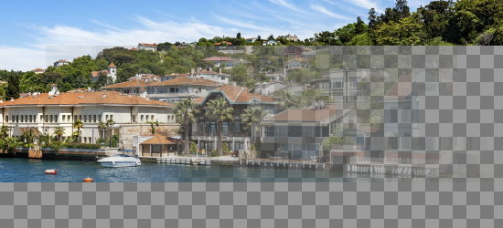
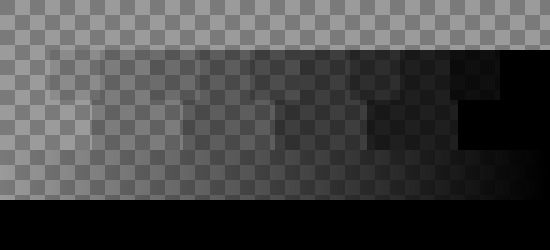

# Blending and Masking

Pixie supports variety of blending modes and some of them can be used for masking as well.

Starting with background image by Hulki Okan Tabak @hulkiokantabak of Bosphorus Coast, Istanbul, Turkey:


Here is what blends are capable of:

### NormalBlend

The default blend for everything. Just blends the colors normally.


### DarkenBlend


### MultiplyBlend


### ColorBurnBlend


### LightenBlend


### ScreenBlend


### ColorDodgeBlend


### OverlayBlend


### SoftLightBlend


### HardLightBlend


### DifferenceBlend


### ExclusionBlend


### HueBlend


### SaturationBlend


### ColorBlend


### LuminosityBlend


## Masking

Masking is just a special blend mode.

### Use MaskBlend to simulate a intersection of masks.

MaskBlend is the default blend for masking operations.


### Use NormalBlend to simulate a union of masks.


### Use SubtractMaskBlend to simulate a subtraction of masks.


### Use ExcludeMaskBlend to simulate a exclusion of masks.


<!-- ### MaskBlend

Default masking blend that is used to mask out or cut out areas.



### SubtractMaskBlend

Subtract is just the opposite of mask blend.


### ExcludeMaskBlend

 -->

## OverwriteBlend

Overwrite blend is special in that it copies the data from one image into another as fast as possible.

This blend is only safe to use on to an image you know is empty. Usually an image that was just created.
Otherwise odd artifacts will happen.

You can replace NormalBlend with OverwriteBlend if you know that the image you are drawing to is empty.
Using OverwriteBlend here is faster as it does not care what
pixies background has:

```nim
import pixie
let
  background = newImage(100, 100)
  profile = readImage("images/circleProfile.png")
background.draw(profile, blendMode = OverwriteBlend)
background.writeFile("images/overwriteBlend.png")
```


