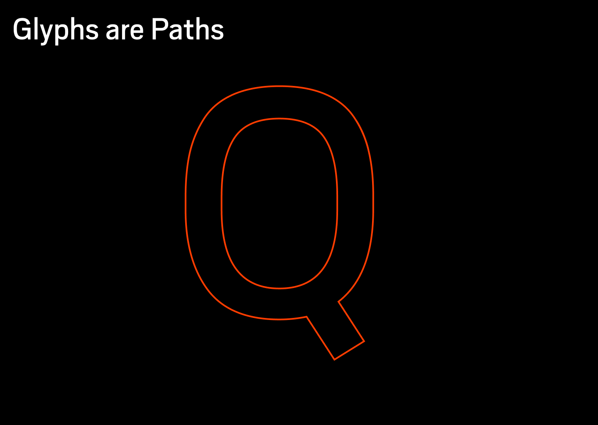
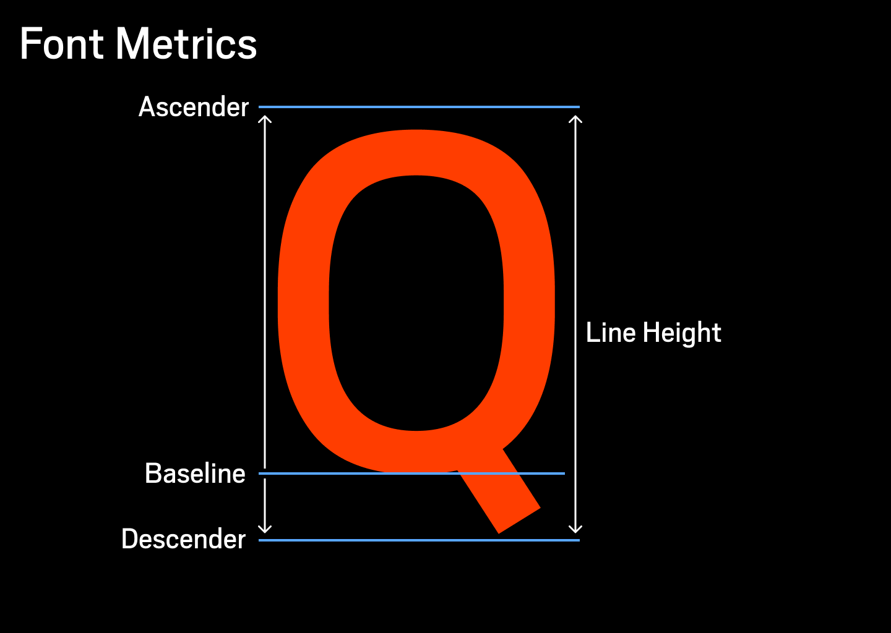
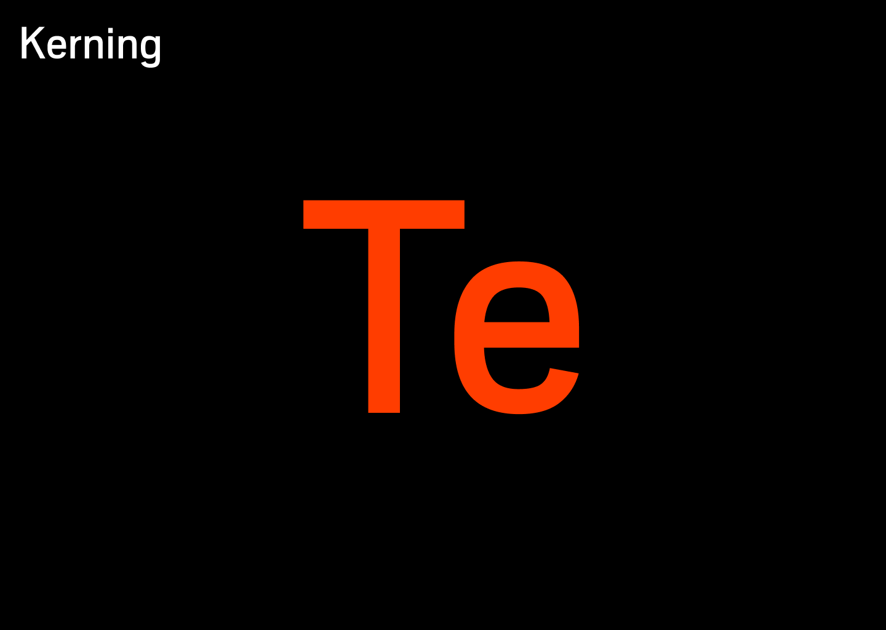
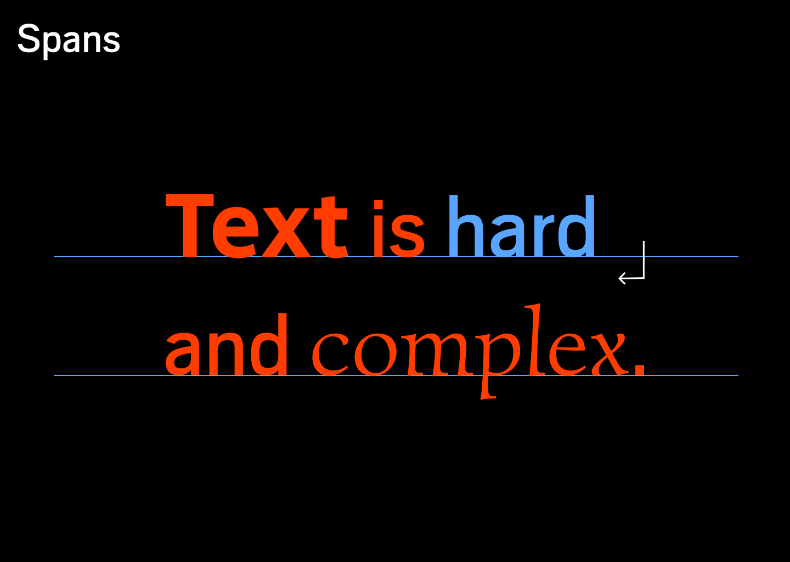

# Text

Pixie is a library that is designed to provide a simple and efficient way to draw text on screen. It is intended to be used as a replacement for other text rendering libraries such as FreeType, HarfBuzz, and Pango, which are commonly used in graphics applications and operating systems.

One of the main goals of Pixie is to provide a unified system for drawing text, which means that it can be used to render text in a consistent way across different platforms and devices. This can make it easier for developers to create consistent applications that display text correctly on different devices and operating systems.

Pixie is designed to be lightweight and easy to use, and it offers a number of features that make it a useful tool for text rendering. For example, it supports a wide range of font formats and can handle complex text layouts. It also includes support for advanced typography features like kerning.

Rendering text on screen can be a challenging task because there are so many different languages and writing modes to consider. Each language has its own unique set of characters, and different languages have different rules for how those characters should be displayed and positioned. This can make it difficult to create a system that can handle text rendering for all languages in a consistent and accurate way.

But at its basic level text is just a collection of glyphs (letters) and glyphs are just paths.

Each glyph has a set of metrics that you can query from the typeface.
The metrics explain how a glyphs should fit with the other glyphs.

Its very important to get kerning correct.
You can see how obviously bad incorrect kerning looks like:

The kerning refers to distance or more properly the adjustment of the default distance between the letters.
Kerning can be negative or positive.

Its important to get text to be kerned correctly.

## Spans

In Pixie, a `Span` is a contiguous block of text with the same font, size, and paint color. A `Span` is used to apply a consistent set of formatting options to a range of text within a document or other text-based content.

You can layout any number of spans following each other in order to create complex layouts. This can be useful for creating documents with multiple fonts, sizes, and colors.

It is generally recommended to end a span on a space or a newline because there is typically no kerning between letters of different fonts and sizes. Without kerning, the spacing between letters of different fonts and sizes may not be consistent, which can make text difficult to read. By ending a span on a space or newline, you can ensure that the spacing between letters is consistent and that the text is easy to read.
