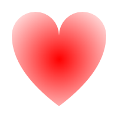
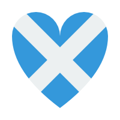
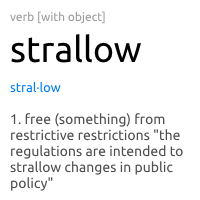
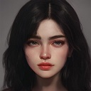

# Pixie tutorial

So you came to the right place, here I will help you out with how with pixie basics and how to use it in your projects.

Are you looking for the API reference? https://nimdocs.com/treeform/pixie/pixie.html

## Installing pixie.

## Nim

* Nimble https://nimble.directory/pkg/pixie
* Github http://github.com/treeform/pixie

```sh
nimble install pixie
```

Then just import it:

```nim
import pixie
```

### Python

* Pypi https://pypi.org/project/pixie-python
* Github http://github.com/treeform/pixie-python

```sh
pip install pixie-python
```

Then just import it:

```python
import pixie
```

or

```python
from pixie import *
```

<!-- ### C
```sh
git clone http://github.com/treeform/pixie-c
```

Then make sure to add the pixie.h to your include dir and copy the pixie.dll/.so/.dylib next to your binary and link the pixie dll.

```sh
gcc ... -I../src/pixie/ -L. -lpixie
``` -->

## Drawing paths

You can either load paths from a standard SVG style string or build it up with methods.

```nim
var heart1 = newImage(200, 200)
heart1.fill(rgba(255, 255, 255, 255))

heart1.fillPath(
  """
    M 20 60
    A 40 40 90 0 1 100 60
    A 40 40 90 0 1 180 60
    Q 180 120 100 180
    Q 20 120 20 60
    z
  """,
  "#FC427B"
)

heart1.writeFile("images/heart1.png")
```

Will produce:


But you can also build the path with path commands:


```nim
var heart2 = newImage(200, 200)
heart2.fill(rgba(255, 255, 255, 255))

var heartPath = newPath()
heartPath.moveTo(20, 60)
heartPath.ellipticalArcTo(40, 40, 90, false, true, 100, 60)
heartPath.ellipticalArcTo(40, 40, 90, false, true, 180, 60)
heartPath.quadraticCurveTo(180, 120, 100, 180)
heartPath.quadraticCurveTo(20, 120, 20, 60)
heartPath.closePath()

heart2.fillPath(heartPath, "#FC427B")
heart2.writeFile("images/heart2.png")
```

Both methods will produce the same image:


You can use paths to draw almost anything.

## Gradients

```nim
var heart3 = newImage(200, 200)
heart3.fill(rgba(255, 255, 255, 255))

let gradientPaint = newPaint(RadialGradientPaint)
gradientPaint.gradientHandlePositions = @[
  vec2(100, 100),
  vec2(200, 100),
  vec2(100, 200)
]
gradientPaint.gradientStops = @[
  ColorStop(color: color(1, 0, 0, 1), position: 0),
  ColorStop(color: color(1, 0, 0, 0.15), position: 1.0),
]

heart3.fillPath(
  """
    M 20 60
    A 40 40 90 0 1 100 60
    A 40 40 90 0 1 180 60
    Q 180 120 100 180
    Q 20 120 20 60
    z
  """,
  gradientPaint
)

heart3.writeFile("images/heart3.png")
```



## Masking

Pixie supports many different blends and masking modes. You can use masking blends modes to mask out areas of the image. Here we will draw a background "X" then cut the heart path out of it.

```nim
var background = newImage(200, 200)

background.fill("#3498db")

background.strokePath(
  """
    M 25, 25
    L 175, 175
    M 25, 175
    L 175, 25
  """,
  paint = "#ecf0f1",
  strokeWidth = 30
)

background.writeFile("images/masking1.png")
```

You can see this produces crossed lines:


Mask paint is a special type of paint that has `blendMod` set to `MaskBlend`.
Instead of adding color to the image the `MaskBlend` will eat color a way:

```nim
var maskPaint = newPaint(SolidPaint)
maskPaint.color = color(1, 1, 1, 1)
maskPaint.blendMode = MaskBlend
```

And now you can just draw the path normally but with the new mask paint:

```nim
var mask = newImage(200, 200)
background.fillPath(
  """
    M 20 60
    A 40 40 90 0 1 100 60
    A 40 40 90 0 1 180 60
    Q 180 120 100 180
    Q 20 120 20 60
    z
  """,
  maskPaint
)

background.writeFile("images/masking2.png")
```



This results in a cutout "X" image.

## Drawing text

Pixie has many powerful text features.

You can typeset text in different ways:

```nim
var textImage = newImage(240, 70)
textImage.fill("#FFFFFF")
var font = readFont("fonts/Roboto-Regular_1.ttf")
font.size = 40

let text = "Hello world."

textImage.fillText(font.typeset(text, vec2(240, 60)), translate(vec2(10, 10)))
textImage.writeFile("images/text1.png")
```


Text is layed out in spans and spans are layed out into an arrangement.  You can create different spans of text of different fonts and sizes.

```nim
textImage = newImage(200, 200)
let typeface = readTypeface("fonts/Ubuntu-Regular_1.ttf")

proc newFont(typeface: Typeface, size: float32, color: Color): Font =
  result = newFont(typeface)
  result.size = size
  result.paint.color = color

let spans = @[
  newSpan("verb [with object] ",
    newFont(typeface, 12, color(0.6, 0.6, 0.6, 1))),
  newSpan("strallow\n", newFont(typeface, 36, color(0, 0, 0, 1))),
  newSpan("\nstral·low\n", newFont(typeface, 13, color(0, 0.5, 0.953125, 1))),
  newSpan("\n1. free (something) from restrictive restrictions \"the regulations are intended to strallow changes in public policy\" ",
      newFont(typeface, 14, color(0.3125, 0.3125, 0.3125, 1)))
]

textImage.fill("#FFFFFF")
textImage.fillText(typeset(spans, vec2(180, 180)), translate(vec2(10, 10)))
textImage.writeFile("images/text2.png")
```



### Supported features

Currently pixie supports many text features but not all of them:

| Description                     | Supported
| ------------------------------- | ---------
| ASCII English                   | ✅
| European Alphabets              | ✅
| Other Alphabets                 | ✅
| CJK - Chinese/Japanese/Korean   | ✅
| Cursive Fonts                   | some
| Emoji                           | no
| RTL - Arabic/Hebrew             | no
| Unicode shaping                 | no
| Ligatures                       | no

## For websites

Do you have a server that needs to crop or scale images? You can use uploaded file size and `image.readImageDimensions()` to first make sure its an image you want to load:

```nim
let size = readImageDimensions("images/profile.jpeg")
echo size
if size.width > 512 or size.height > 512:
  quit("Image dimensions too big")
```

Now that we know its not to big to cause memory issues we can read and crop it:

```nim
var profile = readImage("images/profile.jpeg")
var smallProfile = profile.resize(64, 64)
smallProfile.writeFile("images/smallProfile.png")
```

We made a bigger image:



Turn into a 64x64 profile image:


You can also cut people out of a circle for those new "modern profiles images". Simply mask some thing with a circle like this:

```nim
var maskPath = newPath()
maskPath.circle(32, 32, 32)
smallProfile.fillPath(maskPath, maskPaint)
```
Then just write it out:
```nim
smallProfile.writeFile("images/circleProfile.png")
```


Some times you don't have a person's photo and want to just create a colored circle with the letter.
First we will draw the background circle:

```nim
var letterProfile = newImage(64, 64)
var path = newPath()
path.circle(32, 32, 32)
var paint = newPaint(SolidPaint)
paint.color = parseHtmlColor("#2ecc71")
letterProfile.fillPath(path, paint)

letterProfile.writeFile("images/letterProfile1.png")
```

That looks like this:


Then we will draw the foreground letter:

```nim
var profileFont = readFont("fonts/Roboto-Regular_1.ttf")
profileFont.size = 36
profileFont.paint = "#ecf0f1"
let profileLetters = "Ev"
letterProfile.fillText(profileFont.typeset(
  profileLetters,
  vec2(64, 64),
  hAlign = CenterAlign,
  vAlign = MiddleAlign
))
```

And this is what you get:

```nim
letterProfile.writeFile("images/letterProfile2.png")
```


## For games and openGL

You can load an image and convert it to a texture like this:

```nim
import opengl

proc loadTexture() =
  let testTexture = readImage("examples/data/testTexture.png")

  var textureId: uint32
  glGenTextures(1, textureId.addr)
  glBindTexture(GL_TEXTURE_2D, textureId)
  glTexImage2D(
    target = GL_TEXTURE_2D,
    level = 0,
    internalFormat = GL_RGBA8.GLint,
    width = testTexture.width.GLsizei,
    height = testTexture.height.GLsizei,
    border = 0,
    format = GL_RGBA,
    `type` = GL_UNSIGNED_BYTE,
    pixels = cast[pointer](testTexture.data[0].addr)
  )
  glTexParameteri(GL_TEXTURE_2D, GL_TEXTURE_MAG_FILTER, GL_NEAREST)
  glTexParameteri(GL_TEXTURE_2D, GL_TEXTURE_MIN_FILTER, GL_NEAREST)
  glTexParameteri(GL_TEXTURE_2D, GL_TEXTURE_WRAP_S, GL_CLAMP)
  glTexParameteri(GL_TEXTURE_2D, GL_TEXTURE_WRAP_T, GL_CLAMP)
```


See the complete working example: https://github.com/treeform/windy/blob/master/examples/textured_quad.nim


> Keep in mind that pixie images are in premultiplied alpha state.
> We recommend doing all alpha blending in premultiplied alpha for 2d and 3d graphics.
